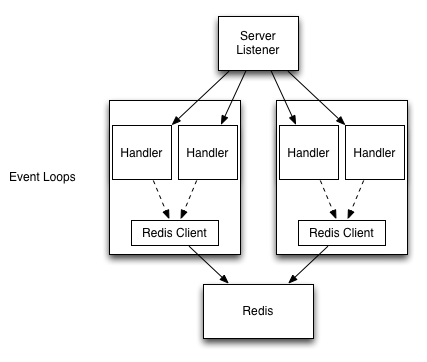

# Quick Start

This guide will get you familiar with Colossus and help you write your first service.

## Anatomy of a Service

Before we get to writing code, it will help to understand the basics about what
Colossus is for and how it works.  While Colossus is a fully generalized I/O
framework for building many different types of applications, this guide is
focused on the primary use case, services.  A **Service** is a reactive server
application that receives incoming requests from clients, processes them (often
in parallel), and returns responses.

To be even more specific, Colossus is focused on building **Microservices**,
which generally are stateless, single-feature, RESTful HTTP servers which exist
as part of a larger architecture.

A Colossus application consists of roughly two parts:

* A Server that listens on a TCP port and accepts incoming connections
* A set of Workers that provide the environment for processing requests from those connections

Workers are where the majority of a service's business logic is performed.
Workers are reactive event-loops and delegate events to be processed as they are
received.  Generally a service will start one worker per physical CPU core, and
work will be distributed amongst them.

When it comes to writing a service, you supply two components:

* An **Initializer**, which is used to hook environment/setup logic into a worker
* A **Request Handler** which is attached to each connection to do your service's actual work

Whenever a Server accepts a new connection, the connection is transferred and
_bound_ to one of the workers.  The binding process consists of attaching the
connection to the Worker's event-loop and creating a request handler that reacts
to events generated by the connection (such as when new data is available to read or the
connection closes).  It is in this request handler where most of the service's
user-code lives.


## Build a Hello World service

Add the following to your Build.scala or build.sbt:

```sbtshell
libraryDependencies += "com.tumblr" %% "colossus" % "LATEST_VERSION"
```

Colossus is compiled for Scala 2.10 and 2.11 and built against Akka 2.3.

We'll start with a simple "hello world" http service written in a fairly verbose
manner to make things easy to follow:

@@snip [HelloWorld2.scala](../scala/HelloWorld2.scala) { #hello_world_2 }

This will start a basic http server on port 9000:

```bash
> curl localhost:9000/hello
Hello World! (200 OK)

> curl localhost:9000/foo
No route for /foo (404 Not Found)
```


### Closer Look

Let's look at this code piece-by-piece.

@@snip [HelloWorld2.scala](../scala/HelloWorld2.scala) { #hello_world_part1 }

This defines the request handler for the service.  A new request handler is
attached to every connection and does all of the actual request processing.  

The `handle` partial function is where request processing actually happens.  In
it, incoming `HttpRequest` objects are mapped to `HttpResponse`.

Notice that the return value of `handle` is of type `Callback[HttpResponse]`.
Callbacks are the concurrency mechanism Colossus provides to do non-blocking
operations.  They are similar to Scala Futures in their use, but their execution
is entirely single-threaded and managed by the Worker.  Since in this example,
no actual concurrency is required, `Callback.successful` simply wraps our final
result in a Callback.

@@snip [HelloWorld2.scala](../scala/HelloWorld2.scala) { #hello_world_part2 }

The `Initializer` is a long-lived object that is created once per Worker and
manages the service's environment within the worker.  Because Workers are
single-threaded, Initializers provide a place to share resources among all
connections handled by the worker.  In particular this is often where
outgoing connections to external services can be opened.

Initializers also are responsible for providing new connections with request
handlers.  This is how our `HelloService` handler is created.  We provide
Colossus with a function of type `ServerContext => ServerConnectionHandler` and
it gets used like a factory.

Lastly, let's look at the bootstrap code to get the service running

@@snip [HelloWorld2.scala](../scala/HelloWorld2.scala) { #hello_world_part3 }

An `IOSystem` is a collection of Workers with a thin management layer on top.
Servers do not manage their own workers, but instead attach to an IOSystem and
let the system do all the Worker management.  Likewise, on its own, an
IOSystem does nothing and its workers sit idle.

Because an `IOSystem` is really just a set of Akka actors, it requires an `ActorSystem` to start.

@@snip [HelloWorld2.scala](../scala/HelloWorld2.scala) { #hello_world_part4 }

This starts a Server that will listen on port 9000. The important part here is
the third argument, which is a function of type `InitContext => Initializer`.
This is a function that will be sent to every Worker in the IOSystem to
initialize it, so every worker will call this function once.

## Working with Clients

In our next example we'll write a simple HTTP frontend for Redis.  One of the
driving features of Colossus is the ability to do low-latency non-blocking
interactions with external systems.  Redis, being an in-memory database, is an
ideal candidate for the kinds of systems Colossus works best with.  

While Colossus services can easily be built to communicate with any system such
as a SQL database, it currently has native support for Redis, Memcached, and
HTTP clients.  Colossus is protocol agnostic, so writing native adapters for
any protocol is easy.

@@snip [RedisClient.scala](../scala/RedisClient.scala) { #redis-client }

Here, we create a `ServiceClient` using the redis protocol in the service's
`Initializer`.  This means that one connection to Redis is opened per Worker,
and all connections handled by that worker will use this client.  Again, since
everything here is per-worker and hence single-threaded, there are no issues
with many request handlers using the same redis client. 

This gives us a service that conceptually looks like:



The client's `send` method returns a `Callback[Reply]` that can be mapped and
flatMapped just like a regular Scala Future.  In fact Callbacks implement most
of the same methods as Futures, including `recover` and `sequence`.

## Working with Futures

So far all the request-handling code we've seen has been effectively
single-threaded.  Even though our service has multiple workers running in
parallel, everything in the context of a single request handler is
single-threaded.

Sometimes this is not what we want.  If processing a request involves either
performing some CPU intensive operation or using a blocking API, the Worker's
event-loop will get stuck waiting, causing high latency on any other connections
that happen to be bound to it.  In other cases, we need all our request handlers
interacting with some form of shared state.

Consider this service:

@@snip [Fibonacci.scala](../scala/Fibonacci.scala) { #fibonacci }

By starting an IOSystem with just one Worker, we can be sure all connections are
being handled by the same worker.  Now if you hit the url `/fib/1000000`, it
will take the server quite a while to calculate this.  But since this is
happening in the worker's thread, no other request handling can happen and all
other requests to the server, even those to the `/hello` route, will be blocked
until it completes.

The best way to avoid this situation is to offload the calculation to a separate thread using Sala Futures.  This is easy to do using `Callback.fromFuture`:

@@snip [Fibonacci.scala](../scala/Fibonacci2.scala) { #fibonacci2 }

This will let the calculation of the result happen in another thread, and once
the Future is complete, execution will be moved back into the Worker and the
response will be built and sent back to the client.

Of course, this works even when a connection is pipelining multiple requests at
the same time on a single connection.  Colossus will continue to process
incoming requests even while it is waiting for existing ones to complete, making
it easy to parallelize work.

Lastly, let's add some caching to this service by using Memcached

@@snip [Fibonacci.scala](../scala/Fibonacci3.scala) { #fibonacci3 }

In this case, all of the memcached interactions are still happening entirely in
the worker's thread, with cache misses being offloaded to another thread to keep
the event loop unblocked.  On modern hardware, this service could easily handle
hundreds of thousands of requests per second.

